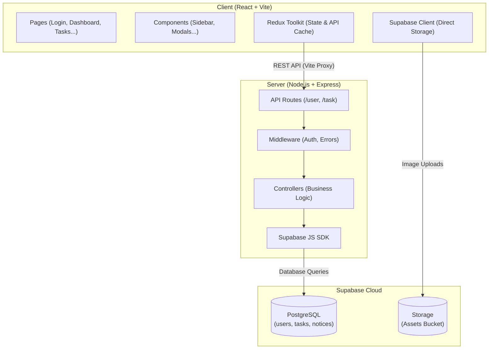
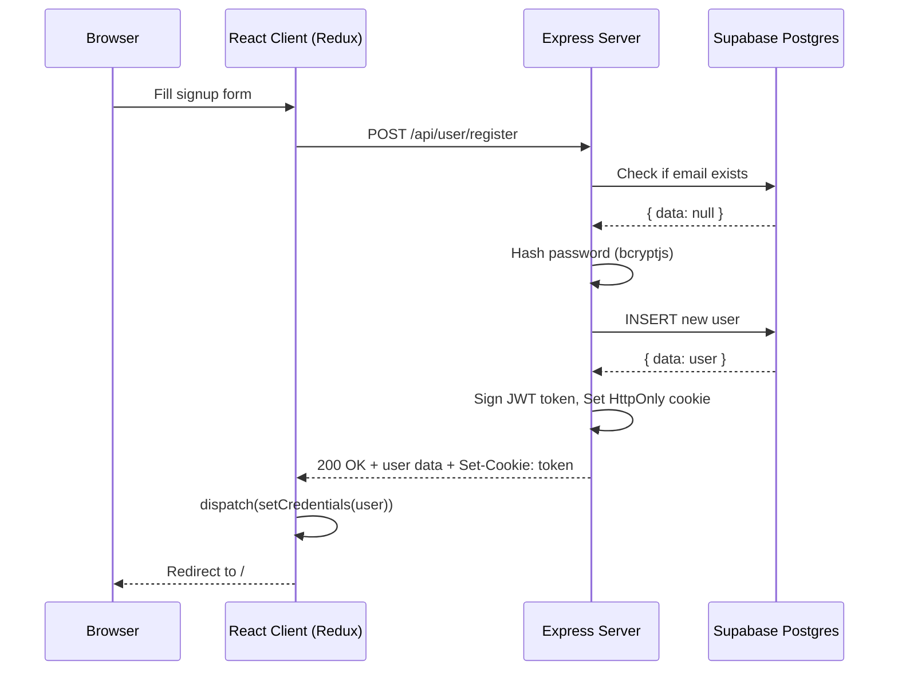
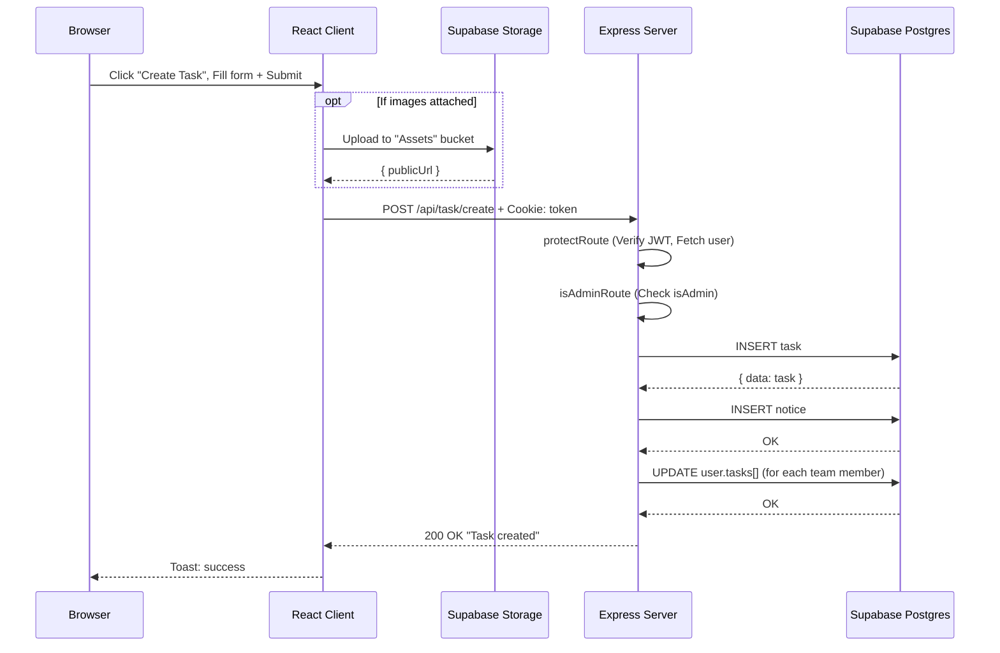
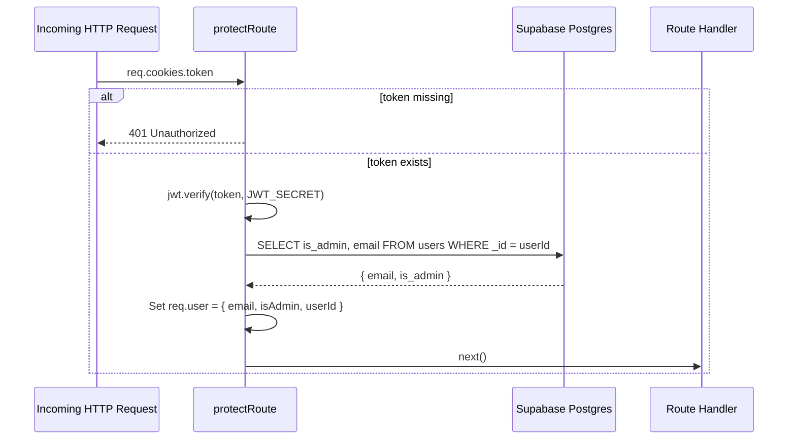
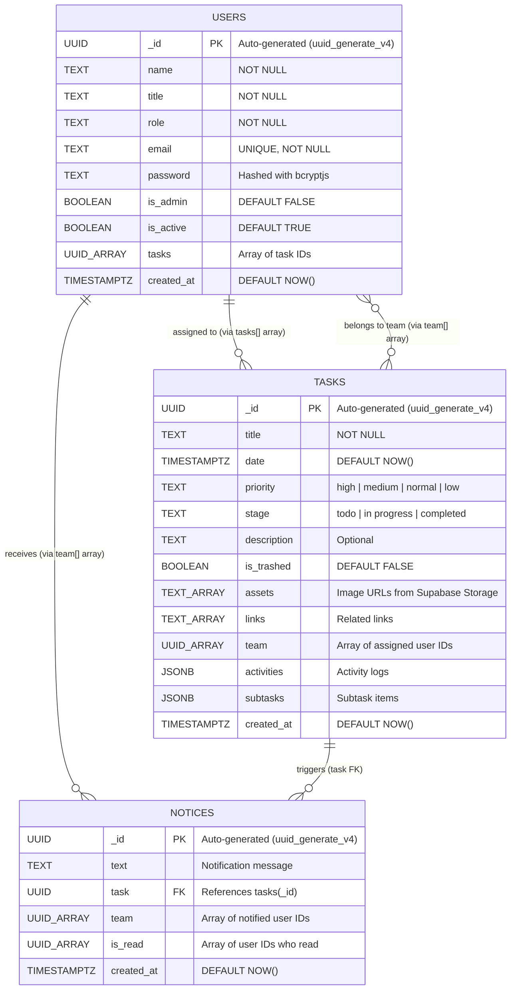

# Ethara AI Assignment

A Team Task Management Web Application where users can create and join projects, assign tasks, and track progress.

Each user should have a role (Admin or Member), and tasks should be manageable within teams.


---

## Table of Contents

- [High-Level Architecture](#high-level-architecture)
- [Sequence Diagrams](#sequence-diagrams)
- [API Documentation](#api-documentation)
- [Database Schema](#database-schema)
- [Project Setup](#project-setup)
- [Folder Structure](#folder-structure)
- [Technologies Used](#technologies-used)

---

## High-Level Architecture



---

## Sequence Diagrams

### 1. User Registration & Login Flow



### 2. Create Task Flow (Admin Only)



### 3. Authentication Middleware Flow (Every Protected Request)



---

## API Documentation

Base URL: `/api`

### Authentication & Authorization Middleware

| Middleware | Description |
| :--- | :--- |
| `protectRoute` | Verifies the JWT cookie on every request. Extracts `userId`, `email`, and `isAdmin` from the token and attaches them to `req.user`. Returns `401` if the token is missing or invalid. |
| `isAdminRoute` | Runs after `protectRoute`. Checks `req.user.isAdmin` — if `false`, returns `401 Not authorized as admin`. |

### User Routes (`/api/user`)

| Method | Endpoint | Description | Auth | Request Body / Params | Success Response |
| :--- | :--- | :--- | :--- | :--- | :--- |
| `POST` | `/register` | Register a new user account | Public | `{ name, email, password, role, title, isAdmin }` | `201` — User object + JWT cookie set |
| `POST` | `/login` | Authenticate and issue JWT | Public | `{ email, password }` | `200` — User object + JWT cookie set |
| `POST` | `/logout` | Clear the JWT cookie | Public | — | `200` — `{ message: "Logged out successfully" }` |
| `GET` | `/get-team?search=` | Get list of all team members (searchable) | Admin | Query: `search` (optional) | `201` — Array of user objects |
| `GET` | `/notifications` | Get unread notifications for the logged-in user | Private | — | `200` — Array of notice objects |
| `GET` | `/get-status` | Get user task status statistics | Admin | — | `200` — Array of users with task data |
| `PUT` | `/profile` | Update user profile (name, title, role) | Private | `{ _id, name, title, role }` | `201` — `{ status, message, user }` |
| `PUT` | `/read-noti?isReadType=&id=` | Mark notification(s) as read | Private | Query: `isReadType` ("all" or single), `id` | `201` — `{ status, message }` |
| `PUT` | `/change-password` | Change the logged-in user's password | Private | `{ password }` | `201` — `{ status, message }` |
| `PUT` | `/:id` | Activate or deactivate a user account | Admin | Params: `id` — Body: `{ isActive }` | `201` — `{ status, message }` |
| `DELETE` | `/:id` | Permanently delete a user account | Admin | Params: `id` | `200` — `{ status, message }` |

### Task Routes (`/api/task`)

| Method | Endpoint | Description | Auth | Request Body / Params | Success Response |
| :--- | :--- | :--- | :--- | :--- | :--- |
| `POST` | `/create` | Create a new task and notify team | Admin | `{ title, team, stage, date, priority, assets, links, description }` | `200` — `{ status, task, message }` |
| `POST` | `/duplicate/:id` | Duplicate an existing task | Admin | Params: `id` | `200` — `{ status, message }` |
| `POST` | `/activity/:id` | Post a comment/activity to a task | Private | Params: `id` — Body: `{ type, activity }` | `200` — `{ status, message }` |
| `GET` | `/dashboard` | Get dashboard statistics (task counts, priority chart, recent tasks) | Private | — | `200` — `{ totalTasks, last10Task, users, tasks, graphData }` |
| `GET` | `/?stage=&isTrashed=&search=` | Get filtered and sorted list of tasks | Private | Query: `stage`, `isTrashed`, `search` | `200` — `{ status, tasks[] }` |
| `GET` | `/:id` | Get full details of a single task | Private | Params: `id` | `200` — `{ status, task }` |
| `PUT` | `/create-subtask/:id` | Add a subtask to an existing task | Admin | Params: `id` — Body: `{ title, tag, date }` | `200` — `{ status, message }` |
| `PUT` | `/update/:id` | Update task details | Admin | Params: `id` — Body: `{ title, date, team, stage, priority, assets, links, description }` | `200` — `{ status, message }` |
| `PUT` | `/change-stage/:id` | Change the stage of a task (todo/in progress/completed) | Private | Params: `id` — Body: `{ stage }` | `200` — `{ status, message }` |
| `PUT` | `/change-status/:taskId/:subTaskId` | Toggle a subtask's completion status | Private | Params: `taskId`, `subTaskId` — Body: `{ status }` | `200` — `{ status, message }` |
| `PUT` | `/:id` | Move a task to the trash | Admin | Params: `id` | `200` — `{ status, message }` |
| `DELETE` | `/delete-restore/:id?` | Permanently delete or restore trashed tasks | Admin | Params: `id` (optional) — Query: `actionType` (`delete`, `deleteAll`, `restore`, `restoreAll`) | `200` — `{ status, message }` |

---

## Database Schema

All tables are stored in **PostgreSQL** via **Supabase**. The schema is defined in `server/schema.sql`.

### Entity Relationship Diagram



### `users` Table

| Column | Type | Description |
| :--- | :--- | :--- |
| `_id` | `UUID` (PK) | Auto-generated unique identifier |
| `name` | `TEXT` | Full name of the user |
| `title` | `TEXT` | Job title |
| `role` | `TEXT` | Role within the organization |
| `email` | `TEXT` (UNIQUE) | Email address (used for login) |
| `password` | `TEXT` | Hashed password (bcryptjs) |
| `is_admin` | `BOOLEAN` | Whether the user has admin privileges |
| `is_active` | `BOOLEAN` | Whether the account is active |
| `tasks` | `UUID[]` | Array of assigned task IDs |
| `created_at` | `TIMESTAMPTZ` | Account creation timestamp |

### `tasks` Table

| Column | Type | Description |
| :--- | :--- | :--- |
| `_id` | `UUID` (PK) | Auto-generated unique identifier |
| `title` | `TEXT` | Task title |
| `date` | `TIMESTAMPTZ` | Task due date |
| `priority` | `TEXT` | `high`, `medium`, `normal`, or `low` |
| `stage` | `TEXT` | `todo`, `in progress`, or `completed` |
| `description` | `TEXT` | Task description |
| `is_trashed` | `BOOLEAN` | Soft-delete flag |
| `assets` | `TEXT[]` | Array of uploaded image URLs |
| `links` | `TEXT[]` | Array of related links |
| `team` | `UUID[]` | Array of assigned user IDs |
| `activities` | `JSONB` | JSON array of activity logs `[{ type, activity, by, date }]` |
| `subtasks` | `JSONB` | JSON array of subtasks `[{ _id, title, date, tag, isCompleted }]` |
| `created_at` | `TIMESTAMPTZ` | Task creation timestamp |

### `notices` Table

| Column | Type | Description |
| :--- | :--- | :--- |
| `_id` | `UUID` (PK) | Auto-generated unique identifier |
| `text` | `TEXT` | Notification message |
| `task` | `UUID` (FK) | References `tasks(_id)` with `ON DELETE CASCADE` |
| `team` | `UUID[]` | Array of user IDs who should receive this notice |
| `is_read` | `UUID[]` | Array of user IDs who have read this notice |
| `created_at` | `TIMESTAMPTZ` | Notice creation timestamp |

---

## Project Setup

### Prerequisites

- **Node.js** (v18+ recommended)
- **npm**
- A **Supabase** account ([https://supabase.com](https://supabase.com))

---

### 1. Clone the Repository

```bash
git clone <repository-url>
cd ethara-ai
```

### 2. Set Up Supabase

1. Go to [https://supabase.com](https://supabase.com) and create a new project.
2. Wait for the database to provision.
3. Navigate to **Settings > API** and copy your **Project URL** and **API Key (anon/service role)**.
4. Go to the **SQL Editor** in your Supabase dashboard.
5. Copy the contents of `server/schema.sql` and execute it. This creates the `users`, `tasks`, and `notices` tables.
6. Go to **Storage** and create a **public** bucket named `Assets`.
7. Under the bucket's **Policies**, create a policy that allows `INSERT` and `SELECT` for all users (for development).

### 3. Server Setup

```bash
cd server
npm install
```

Create a `.env` file inside the `server/` directory:

```env
SUPABASE_URL=https://your-project-id.supabase.co
SUPABASE_KEY=your-supabase-api-key
JWT_SECRET=any-long-random-secret-string
PORT=8800
NODE_ENV=development
```

Start the development server:

```bash
npm run dev
```

You should see:

```
Server listening on 8800
Supabase connected successfully
```

### 4. Client Setup

```bash
cd client
npm install
```

Create a `.env` file inside the `client/` directory:

```env
VITE_APP_BASE_URL=http://localhost:8800
VITE_APP_SUPABASE_URL=https://your-project-id.supabase.co
VITE_APP_SUPABASE_KEY=your-supabase-api-key
```

Start the development client:

```bash
npm run dev
```

Open [http://localhost:3000](http://localhost:3000) in your browser.

---

## Folder Structure

```
ethara-ai/
├── README.md
│
├── server/
│   ├── .env                    # Environment variables (Supabase, JWT, Port)
│   ├── index.js                # Express app entry point
│   ├── schema.sql              # PostgreSQL table definitions for Supabase
│   ├── package.json
│   │
│   ├── controllers/
│   │   ├── userController.js   # Auth, profile, team, notifications logic
│   │   └── taskController.js   # CRUD tasks, subtasks, activities, dashboard
│   │
│   ├── middleware/
│   │   ├── authMiddleware.js   # JWT verification (protectRoute, isAdminRoute)
│   │   └── errorMiddleware.js  # Global error handler + 404 handler
│   │
│   ├── routes/
│   │   ├── index.js            # Root router (/api)
│   │   ├── userRoute.js        # /api/user/* endpoints
│   │   └── taskRoute.js        # /api/task/* endpoints
│   │
│   └── utils/
│       ├── index.js            # JWT creation + cookie config
│       └── supabase.js         # Supabase client initialization
│
├── client/
│   ├── .env                    # Client environment variables
│   ├── vite.config.js          # Vite config with API proxy
│   ├── package.json
│   │
│   └── src/
│       ├── App.jsx             # Root component with routing
│       ├── main.jsx            # React DOM entry
│       ├── index.css           # Global styles
│       │
│       ├── pages/
│       │   ├── Login.jsx       # Login page
│       │   ├── Signup.jsx      # Registration page
│       │   ├── Dashboard.jsx   # Dashboard with stats and charts
│       │   ├── Tasks.jsx       # Task list (filtered by stage)
│       │   ├── TaskDetail.jsx  # Single task detail view
│       │   ├── Users.jsx       # Team management (Admin)
│       │   ├── Trash.jsx       # Trashed tasks management (Admin)
│       │   └── Status.jsx      # User task status overview
│       │
│       ├── components/         # Reusable UI components (Sidebar, Navbar, Modals, etc.)
│       │
│       ├── redux/
│       │   └── slices/
│       │       ├── apiSlice.js          # RTK Query base config
│       │       ├── authSlice.js         # Auth state (user, token)
│       │       └── api/
│       │           ├── authApiSlice.js  # Login, Register, Logout mutations
│       │           ├── taskApiSlice.js  # All task CRUD queries/mutations
│       │           └── userApiSlice.js  # User management queries/mutations
│       │
│       └── utils/
│           ├── contants.js     # API route constants
│           ├── index.js        # Helper utilities
│           └── supabase.js     # Frontend Supabase client (for Storage)
```

---

## Technologies Used

| Layer | Technology | Purpose |
| :--- | :--- | :--- |
| **Frontend** | React 18 (Vite) | UI framework |
| | Redux Toolkit + RTK Query | State management & API caching |
| | Tailwind CSS | Styling |
| | Headless UI | Accessible UI primitives (modals, transitions) |
| | React Router v6 | Client-side routing |
| | React Hook Form | Form validation |
| | Recharts | Dashboard charts |
| | Sonner | Toast notifications |
| **Backend** | Node.js + Express.js | REST API server |
| | jsonwebtoken (JWT) | Authentication tokens |
| | bcryptjs | Password hashing |
| | cookie-parser | HTTP cookie parsing |
| | express-async-handler | Async error handling |
| **Database** | PostgreSQL (Supabase) | Relational data storage |
| **Storage** | Supabase Storage | Task image/asset uploads |
